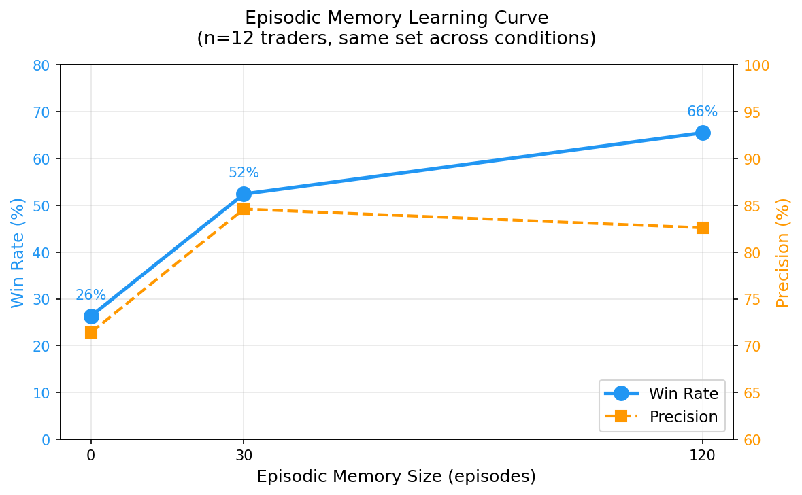

# Portfolio Autopsy

An agentic system that analyzes stock trading portfolios and suggests execution refinements. It investigates actual trades against live market data, surfaces patterns and behavioral biases — and then tests whether it can suggest better entry timing or position structure using only information available at the time of each trade.

The system operates at three levels: (1) retrospective analysis that fact-checks its own claims via automated grounding evaluation, (2) pre-trade refinement that learns from its mistakes via episodic memory, and (3) a conversational interface that makes both accessible in real time. We evaluate rigorously across 50+ trader portfolios, finding that the agent cannot pick winning stocks through reasoning (its apparent stock-picking ability is just price memorization from training data), but it can identify structurally dominated positions and that episodic memory doubles effectiveness by steering suggestions away from what doesn't work.

## How it works

The system is accessed through a conversational interface (`chat.py`) — a working prototype of a floating advisor that would live alongside a brokerage app, answering ad-hoc questions, surfacing pre-trade warnings, and improving its suggestions as it accumulates experience.

```bash
# Interactive portfolio advisor (the primary interface)
python chat.py --trader "Nancy Pelosi" --kaggle /path/to/trades.csv
```

Ask anything in natural language. The agent has 14 tools (market data, Python sandbox, web search, persistent memory) and pulls live data to answer:

```
You: how much did I make on NVDA?
Advisor: [4 tool calls] Your NVDA positions returned +246% ($1.2M profit) across
         3 tranches. Entry timing was excellent — all below $200 pre-split...

You: am I too concentrated in tech?
Advisor: [8 tool calls] Yes. 62% of deployed capital is in 4 tech names (NVDA, AAPL,
         MSFT, GOOG). Your max sector drawdown would be -31% in a 2022-style rotation...

You: what should I watch out for on my next trade?
Advisor: [recalls memory] Based on your pattern: you tend to buy near earnings (3 of
         last 5 entries were within 7 days of reporting). Consider waiting for post-
         earnings clarity — your pre-earnings entries have 22% worse avg return...
```

Persistent memory means the agent accumulates understanding across sessions — it doesn't recompute what it already discovered. The first question about NVDA triggers 4 tool calls; asking again in a later session gets an instant answer from stored findings.

Beyond the chat interface, the system also produces full-portfolio reports (25k words, 110+ tool calls, automated fact-checking) and runs controlled experiments on trade improvement:

```bash
# Full analysis with grounding evaluation
python run.py --trader "Nancy Pelosi" --kaggle /path/to/trades.csv

# Reflection loop (self-improving analysis)
python run_reflect.py --trader "Nancy Pelosi" --iterations 5

# Trade refinement experiments
python experiments/refinement/run_ablation.py --traders 50 --conditions B,C
```

## Research Questions

Building this system raised a series of questions, each one following naturally from the last:

1. **Can you trust LLM-generated financial analysis?** The agent produces confident reports with specific numbers — but how many are fabricated? This led to the grounding evaluator: automated fact-checking that produces a trust score for every report.

2. **Given a trust score, can the system improve itself?** The grounding evaluator produces structured feedback. A reflection agent consumes it and produces guidelines for the next iteration — evolutionary prompt optimization with the trust score as fitness function.

3. **Does reflection always help?** We ran the same reflection loop under information constraints (time-gated, no future data) and found it *hurts* — the same optimization signal produces opposite dynamics depending on data availability.

4. **How much of retrospective analysis is hindsight?** The agent has seen the future. A time-gated variant, restricted to data available at the original trade date, quantifies the bias and classifies each insight as knowable-from-fundamentals vs hindsight-dependent.

5. **What's the smallest model that preserves quality?** Cross-model comparison (Opus, Haiku, Llama) reveals the gap is in reasoning about evidence, not tool mechanics — a distillation target.

6. **How do you make this usable?** A chat interface with persistent memory turns the system from a one-shot report generator into a conversational advisor that builds understanding over time.

7. **Can the agent go beyond analysis and actually improve trades?** Time-gated refinement tests whether the agent can suggest better execution using only pre-trade data. Finding: it can't predict prices (18% timing win rate) but can identify structurally dominated positions (59-71% on instrument swaps).

8. **Can an LLM agent learn from its own failures?** Episodic memory accumulates structured lessons from past refinement outcomes. The agent's win rate doubles (31% → 59%) as it learns which refinement strategies work — not through better predictions, but by shifting its strategy toward what the evidence supports.

9. **Does that learning generalize?** Memory learned from one set of traders transfers to completely unseen traders (41% → 80%), confirming the lessons are structural principles, not trader-specific patterns.

## Phase 1: Automated Portfolio Analysis with Self-Correction

### The hard problem: should you trust it?

An LLM can produce confident financial analysis that's completely fabricated. The bulk of this project is the infrastructure to catch that:

- **Automated fact-checking** — a 3-layer grounding evaluator independently verifies tool call results, cross-checks structured `<claim>` tags against live data, and audits Python sandbox executions. Every report gets a trust score from 0-100.
- **Hindsight bias quantification** — a time-gated variant of the same agent, restricted to data available at the original trade date, measures how much retrospective analysis benefits from knowing the future.

### Self-improving analysis via reflection

Given a measurement framework, can the system improve itself? A reflection agent consumes structured evaluation feedback — which claims failed, which computations errored, where grounding gaps are — and produces specific guidelines injected into the next iteration. This is evolutionary prompt optimization: the trust score is the fitness function, reflection is the mutation operator, and strict improvement gating rolls back regressions automatically.

Over 5 iterations on the Pelosi portfolio, reflection improved the trust score by 6 points (89 to 95), doubled grounded citations (40 to 89), and introduced new analytical depth (Monte Carlo skill tests, VIX regime analysis) — without changing the model or code. The rollback mechanism prevented 3 regressions.

The most interesting finding: the same reflection loop produces opposite dynamics depending on information availability. We ran the loop on a time-gated agent (restricted to pre-2022 data) and an ungated agent (full data access):

```
           | Iteration 1 | Iteration 2 | Iteration 3 | Trajectory
-----------+-------------+-------------+-------------+------------------
Gated      |   92 (A)    |   90 (rej)  |   85 (rej)  | Started high, reflection hurt
Ungated    |   80 (B)    |   92 (A)    |   crashed    | Started low, reflection helped
```

The ungated agent improved 12 points in one iteration. The gated agent started strong and degraded — both subsequent iterations were rejected. The reflection agent's pressure to "cite more" was effective with abundant data but backfired under information constraints, increasing claim volume faster than the limited data could support (claim tags: 26 to 96, grounding rate: 33% to 14%).

The mechanism is a precision-recall tradeoff: reflection optimizes for recall (more citations), which works when the verification ceiling is high but fails when data is scarce. This has implications for deploying reflection-based systems in real-time settings where information is inherently incomplete — optimization dynamics calibrated on backtests may not transfer to production.

### Findings

### Grounding evaluation and trust scores

The 3-layer grounding evaluator automatically fact-checks every claim in the agent's output:
- **Tool call audit** — re-runs a sample of market data lookups independently
- **Claim tag verification** — parses structured `<claim>` tags and cross-checks against live data
- **Python execution review** — audits sandbox computations for errors

Trust scores range from 22/100 (small models hallucinating everything) to 95/100 (Opus with reflection). The score is a deployment gate — reports below threshold are rejected or flagged for human review.

**After 5-iteration reflection loop (Pelosi portfolio):**

```
Iter | Score | Grade | Claim Tags | Grounding | Status
-----+-------+-------+------------+-----------+---------
   1 |    89 |     B |         40 |       27% | baseline
   2 |    82 |     B |         45 |       10% | rejected (rolled back)
   3 |    88 |     B |         55 |       25% | rejected
   4 |    95 |     A |         89 |       37% | accepted (+6 pts)
   5 |    92 |     A |        105 |       31% | rejected
```

### Hindsight bias is real and measurable

Retrospective portfolio analysis is inherently suspect — the agent has seen the answer. When it says "you should have sold GOOGL before the crash," it knows the crash happened. How much analytical value comes from hindsight?

Same agent, same tools, same portfolio — one variable: can the agent access future data? Time-gating is enforced at three layers: tool parameter validation, Python sandbox patching (`yf.download()` capped at cutoff), and web search year filtering.

```
Trader      | Decision Date | Gated Acc (90d) | Ungated Acc (90d) | Hindsight Adv
------------+---------------+-----------------+-------------------+--------------
Pelosi      | 2019-06-07    |             60% |              100% |       +40pp
Pelosi      | 2021-06-15    |             40% |               60% |       +20pp
Tuberville  | 2022-06-15    |             67% |               78% |       +11pp
```

Findings:
- **Hindsight bias is real**: +11 to +40pp accuracy advantage with future data
- **Bias varies by market regime**: pre-COVID bull market (+40pp) vs bear market (+11pp). Bearish conditions are more predictable from current fundamentals
- **Disagreements are informative**: GOOGL flipped from SELL (gated) to BUY (ungated) — the gated agent saw a richly-valued stock, the ungated agent knew it would rally
- **The time-gated agent is a forward-looking advisor**: architecturally identical to a live trading system, achieving 40-67% directional accuracy from available information alone

**Knowability classification — from detection to training signal:**

Each recommendation is automatically classified by comparing gated vs ungated output:
- **KNOWABLE** — same action regardless of future data (agent reached it from fundamentals alone)
- **HINDSIGHT** — action flipped (only justified with future knowledge)
- **MIXED** — directional shift (e.g., BUY to HOLD)
- **UNKNOWN** — ticker appeared in only one agent's output

These labels are a structured training signal: reward KNOWABLE insights, penalize HINDSIGHT-dependent ones. Combined with the RL reward framework (direction correctness + alpha vs SPY + calibration, conviction-weighted, with a time-gate bonus multiplier), this creates a complete (state, action, reward) pipeline ready for GRPO or similar policy optimization.

### Cross-model quality gap

What is the smallest model that preserves analytical quality? Where does quality degrade?

```
Model               | Tool Calls | Report Length | Trust Score | Tool Accuracy
--------------------+-----------+--------------+-------------+--------------
Opus                |         77 |        ~25k  |      88-98  |         100%
Haiku               |         44 |         19k  |          65 |         100%
Llama 4 Scout (17B) |          3 |        1.8k  |          31 |         100%
Llama 3.1 8B        |          0 |        3.4k  |          22 |          50%
```

The Opus to Haiku gap (28 points) is the distillation target: both models use tools correctly (100% accuracy), but Haiku grounds fewer claims to tool data (17% vs 85%+). The gap is in *reasoning about evidence*, not tool mechanics. Llama models fail at structured tool calling entirely.

### Interactive advisor with persistent memory

This is the core product interface — a conversational portfolio advisor that builds understanding over time. The target deployment is a floating widget inside a brokerage app (Robinhood, Schwab, etc.) that can:

- **Answer ad-hoc questions** — "how much did I make on AAPL?", "am I overexposed to tech?"
- **Pop up pre-trade warnings** — "you already have 40% in tech; this buy pushes it to 52%"
- **Surface alerts from analysis** — "your PANW position is 7 days from earnings — historically your pre-earnings entries underperform by 22%"
- **Remember across sessions** — builds a long-term understanding of trading style, biases, and risk tolerance

The agent has two memory tools: `store_memory` (persist an insight for future sessions) and `recall_memory` (retrieve before answering). Memory is organized by type: findings, alerts, metrics, patterns, position summaries. The agent decides what's worth remembering — not every computation, but insights that would be expensive to re-derive.

```
Session 1 (0 memories):
  You: how much profit did i make in 2023?
  [14 tool calls, ~2 minutes]
  Advisor: ~65% return, 2.5x SPY. NVDA +246% was the biggest driver...
  [calling store_memory...] done

Session 2 (1 memory loaded):
  You: how much profit did i have in 2023?
  [calling recall_memory...] done     <-- instant, no recomputation
  Advisor: From my earlier research: ~65% return, NVDA +246%...
```

The first query triggers 14 tool calls and minutes of computation. The same question in a later session gets an instant answer from memory. The agent also proactively stores discoveries it considers important without being asked.

Full chat demo in [`results/sample_report/chat_demo.md`](results/sample_report/chat_demo.md).

### Cross-portfolio validation

Different portfolios surface different issues — the agent adapts its analysis (factor decomposition for concentrated tech, transaction cost modeling for frequent traders, premium efficiency for options-heavy portfolios).

```
Trader      | Trades | Capital    | Tool Calls | Trust | Grade | Key Finding
------------+--------+-----------+-----------+-------+-------+---------------------------
Pelosi      |    146 |    $72M   |       110 |    95 |     B | LEAPS strategy, disposition effect
Tuberville  |    133 |    $6.5M  |        85 |    88 |    D+ | Systematic value destruction
Phillips    |     47 |    $2.1M  |        72 |    85 |    C+ | Sector concentration risk
```

## Usage

```bash
pip install -r requirements.txt

# Option 1: Direct Anthropic API
export ANTHROPIC_API_KEY=sk-...

# Option 2: AWS Bedrock
export AWS_ACCESS_KEY_ID=...
export AWS_SECRET_ACCESS_KEY=...
export AWS_SESSION_TOKEN=...        # if using temporary credentials

# Full analysis with grounding evaluation
python run.py --kaggle /path/to/trades.csv --trader "Nancy Pelosi"

# Reflection loop (analyze -> evaluate -> reflect -> re-analyze)
python run_reflect.py --trader "Nancy Pelosi" --iterations 5

# Time-gated analysis (forward-looking advisor mode)
python run.py --trader "Nancy Pelosi" --as-of-date 2022-06-01

# Time-gated reflection loop
python run_reflect.py --trader "Nancy Pelosi" --iterations 3 --as-of-date 2022-06-01

# Hindsight bias experiment (ablation study)
python run_experiment.py --trader "Nancy Pelosi" --decision-dates "2019-06-07,2021-06-15"

# Cross-model comparison (via OpenAI-compatible endpoint)
python run_distill.py --trader "Nancy Pelosi" --teacher qwen/qwen3.6-27b --student qwen/qwen3-4b

# Interactive chat with memory
python chat.py --trader "Nancy Pelosi"

# Skip evaluation (faster)
python run.py --trader Pelosi --skip-eval
```

The system works on any trade log with dates, tickers, and amounts. Congressional trades from the [Kaggle STOCK Act dataset](https://www.kaggle.com/datasets/theeconomist/congress-trading) are used as a public demonstration dataset.

## System Architecture

```
Trade Data (CSV)
      |
  Portfolio Builder --- parse options, group by ticker, build timeline
      |
  Portfolio Advisor Agent (Claude + tools)
  |-- 12 market data tools (prices, returns, benchmarks, VIX, earnings, drawdowns)
  |-- Python sandbox (numpy, pandas, scipy, yfinance)
  |-- Web search (DuckDuckGo)
  |-- Persistent memory (store/recall findings across sessions)
  |
  |   Agent reasons -> calls tools -> computes metrics -> searches for context
  |   -> synthesizes report with <claim> tags
  |
  Grounding Evaluator
  |-- Tool call audit (re-run sample, verify data)
  |-- Claim tag verification (independently compute claimed values)
  |-- Python execution review (check for errors)
  +-- Trust score (weighted composite 0-100)
      |                                    |
  Report + Scorecard                Reflection Agent
                                    |-- Analyzes eval failures
                                    |-- Produces specific guidelines
                                    |-- Strict improvement gating
                                    +-- Guidelines injected into next run
                                           |
                                    Improved Report (iterate)
```

## Project Structure

```
run.py                    # Full analysis + eval pipeline
run_reflect.py            # Reflection loop (analyze -> eval -> reflect -> iterate)
run_experiment.py         # Hindsight bias experiment (ablation study)
run_distill.py            # Cross-model comparison (OpenAI-compatible endpoints)
chat.py                   # Interactive chat interface with memory
src/
  agent/
    advisor.py            # Portfolio analysis agent (+ time-gated mode)
    strategist.py         # Forward-looking strategist (time-gated + ungated)
    reflect.py            # Reflection agent (eval -> guidelines)
    refiner.py            # Trade refinement agent (time-gated execution advice)
    memory.py             # Persistent + episodic memory (PortfolioMemory + EpisodicMemory)
    tools.py              # 14 tool definitions + dispatcher
    sandbox.py            # Python code execution sandbox
    websearch.py          # DuckDuckGo web search
    openai_compat.py      # OpenAI-compatible API adapter (vLLM, Ollama, OpenRouter)
    bedrock_converse.py   # Bedrock Converse adapter (Llama, etc.)
  data/
    portfolio.py          # Kaggle data loader + portfolio builder
    market.py             # Market data functions (yfinance)
  eval/
    grounding.py          # 3-layer grounding evaluator + trust score
    refinement.py         # Trade refinement evaluator (returns + risk metrics)
    hindsight.py          # Hindsight bias evaluation + comparison
    knowability.py        # Knowability classification (KNOWABLE/HINDSIGHT/MIXED)
    rl_rewards.py         # RL reward computation (direction + alpha + calibration)
experiments/
  refinement/
    README.md             # Full experiment writeup with results
    run_ablation.py       # Controlled ablation (scope × memory × selection)
    run_learning_curve.py # Memory accumulation experiment
    run_transfer.py       # Transfer learning (train/test trader split)
    run_refine_full.py    # Full-portfolio refinement (single agent call)
    run_refine.py         # Per-trade refinement (one call per trade)
    run_experiment_batch.py  # Batch runner across 100 traders
    run_confidence_calibration.py  # Metacognition analysis
    plot_results.py       # Publication-quality figures
    results/              # Plots and summary reports
tests/
  test_portfolio.py       # Data parsing, portfolio summary building (17 tests)
  test_grounding.py       # Claim extraction, tag parsing, trust scoring (20 tests)
  test_memory.py          # Persistent memory store/recall/persistence (17 tests)
  test_tools.py           # Tool definitions, dispatcher, serialization (13 tests)
  test_time_gate.py       # Time-gate, knowability, RL rewards (32 tests)
```

106 tests, all passing. Coverage spans data parsing, grounding evaluation, memory persistence, tool dispatch, time-gate enforcement, knowability classification, and RL reward computation — all without requiring API calls or network access.

## Design Decisions

See [design.md](design.md) for the full design document.

**Why agent + sandbox, not a fixed pipeline?** The agent decides what analysis matters — different portfolios surface different issues. The 12 pre-built tools are convenience; the Python sandbox is capability.

**Why structured claim tags?** LLMs hallucinate numbers. The `<claim>` tag system forces source citation and enables automated verification. This is the observability layer for safely increasing model autonomy.

**Why a reflection loop?** The eval framework produces structured feedback. The reflection agent converts failures into specific guidelines. This is evolutionary prompt optimization — the system improves through self-reflection, not gradient updates. With strict improvement gating, regressions are automatically rolled back.

**Why time-gating?** A retrospective agent that has seen the future cannot give honest advice. The time-gated variant is architecturally identical to a live trading advisor — proving the system works for both retrospective and forward-looking analysis, and quantifying exactly how much hindsight inflates perceived quality.

## Phase 2: Can the Agent Suggest Better Execution?

Beyond analysis, we tested whether the agent can *improve* execution — suggesting better timing, instruments, or sizing for each trade, using only data available at the time.

**Key findings** (detailed in [`experiments/refinement/`](experiments/refinement/)):

| Finding | Evidence |
|---------|----------|
| LLMs cannot predict short-term prices | 18% win rate on timing suggestions (n=83) |
| LLMs can identify structurally dominated positions | 59-71% win rate on instrument swaps |
| Unrestricted stock selection measures memorization | 88.6% win rate = model recall, not reasoning |
| Episodic memory doubles win rate | 31% → 59% (n=31 traders) |
| Memory improvement is monotonic with experience | 26% → 52% → 66% (0/30/120 episodes) |
| Memory transfers to unseen traders | 41% → 80% on held-out test set |

The research contribution: **episodic memory that accumulates structured lessons from past refinement attempts and adapts the agent's strategy based on evidence.** The agent learns to stop doing what doesn't work (timing predictions) and focus on what does (structural risk reduction via diversification).



```bash
# Run ablation study (B vs C: no-memory vs memory)
python experiments/refinement/run_ablation.py --traders 50 --conditions B,C

# Run learning curve experiment
python experiments/refinement/run_learning_curve.py --traders 20

# Run transfer learning test
python experiments/refinement/run_transfer.py --traders 30

# Analyze confidence calibration (no API calls)
python experiments/refinement/run_confidence_calibration.py
```

## Current Limitations

**Phase 1 (analysis):** The reflection improvement trajectory (89 to 95) and the reflection × time-gating interaction are measured on a single portfolio (Pelosi). The grounding evaluator has not been meta-evaluated against human judgment — it scores the agent's output, but no one has scored the scorer.

**Phase 2 (refinement):** The strongest finding (learning curve 26% → 66%) is measured on 12 traders — statistically significant but would benefit from larger n. Instrument swap performance (59-71%) rests on only 17-19 episodes at the category level. The transfer result (41% → 80%) is n=10 test traders — directionally strong but needs replication. Model contamination in the "any-stock" condition means we cannot cleanly separate structural insight from memorization for instrument swaps — the risk-reduction metric (drawdown) is our decontamination proxy but is not a perfect substitute.

**Shared:** Phase 1 experiments (reflection, grounding) use Claude Opus; Phase 2 experiments (refinement, memory) use Claude Haiku — both via Bedrock. We do not test whether refinement findings generalize across model families. Congressional trades are publicly disclosed with a 45-day reporting delay — results may not transfer to proprietary trade logs with different characteristics.

## Roadmap

### Episodic memory extensions
- **Larger learning curves**: test whether performance plateaus at 120 episodes or continues improving at 500+. Current evidence shows monotonic gain but no saturation signal yet.
- **Per-category memory**: separate memory streams for instrument swaps vs timing vs sizing. The current system aggregates; specialized memory may be sharper.
- **Post-cutoff decontamination**: test on stocks that IPO'd after the model's training cutoff, fully eliminating the model-weight contamination concern.

### Distillation
- **Teacher-student pipeline**: Opus generates ~30 tool-calling turns per portfolio. 100 portfolios = ~3,000 turn-level SFT examples. The cross-model adapter (`run_distill.py`) already collects trajectories in OpenAI format.
- **Distillation target**: Opus to Haiku gap (28 trust points) with identical tool accuracy — the gap is in reasoning about evidence, not tool mechanics. Fine-tune Haiku or Qwen3-4B on Opus trajectories using the trust score as the evaluation metric.

### Reinforcement learning
- **Trust score as reward**: the grounding evaluator produces a scalar signal per report. Combined with knowability labels (reward KNOWABLE insights, penalize HINDSIGHT-dependent ones), this creates a complete (state, action, reward) pipeline for GRPO or PPO.
- **Episodic memory as reward shaping**: use accumulated episode statistics to shape the reward landscape — discount timing suggestions (known 18% win rate) and upweight instrument swaps (59%+).

### Production
- **Real-time deployment**: the time-gated agent is architecturally identical to a live trading advisor. Add streaming market data, position monitoring, and alert triggers.
- **Brokerage integration**: the chat interface with persistent memory maps to a sidebar advisor in a brokerage app — ad-hoc Q&A, pre-trade warnings, proactive alerts from accumulated analysis.
- **Memory-informed pre-trade screening**: before each trade, the agent automatically checks for structural dominance (same thesis, better vehicle) using its accumulated experience about what swaps succeed.
